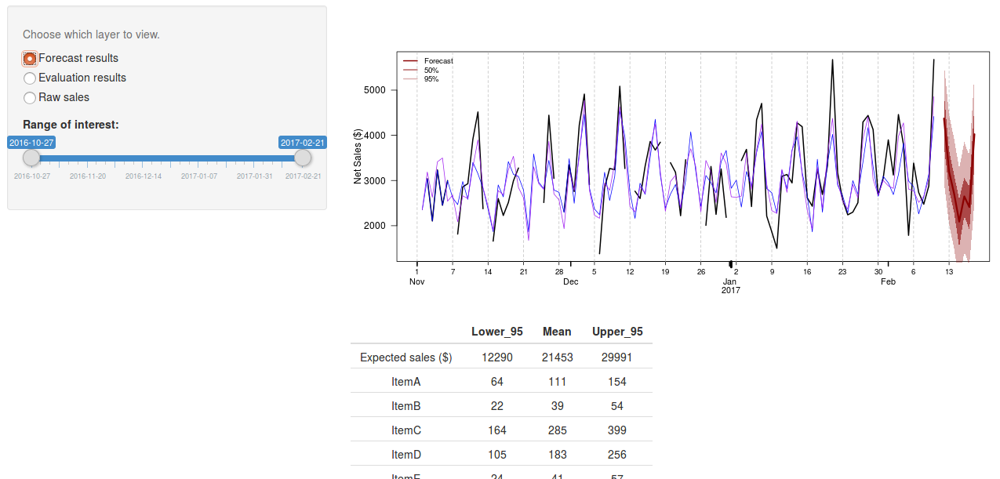

# Demand Forecasting
## For small businesses

This app forecasts one week of sales ($ and #) for goods/services of interest. Predictions are generated dynamically from a pool of temperature, weather, economic, and local event data, as well as periodic fixed factors that can account for unknown payday patterns and other "anonymous" drivers of demand. Predictions are also informed by past trends, including magnitude and variability of demand. The prediction engine is comprised of two time-series models, ARIMA and STLM, working as an ensemble.

#### [Click here for app demo.](https://vlahm.shinyapps.io/demand_forecast/)

---
## **Contact the author**
Mike Vlah:
+ vlahm13@gmail[dot]com
+ [linkedin.com/in/michaelvlah]
